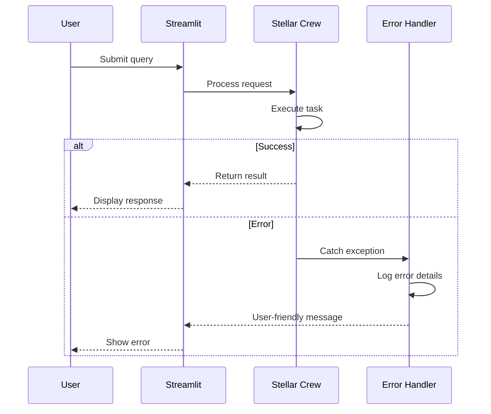

# Stellar Connect Coding Standards

This document defines the coding standards and conventions for the Stellar Connect project. It is derived from the main [architecture document](../architecture.md) and serves as a focused reference for development practices.

## Critical Fullstack Rules

- **Environment Variables:** Always access through CONFIG object, never os.getenv() directly
- **Error Handling:** All database operations must use try/except with proper logging
- **Type Safety:** Use Pydantic models for all structured data extraction
- **Resource Management:** Explicitly initialize and close database connections
- **File Paths:** Use os.path.join() for cross-platform compatibility
- **Async Operations:** Use proper context managers for file and database operations

## Naming Conventions

| Element | Frontend | Backend | Example |
|---------|----------|---------|---------|
| Functions | snake_case | snake_case | `process_new_file()` |
| Classes | PascalCase | PascalCase | `SalesRecord` |
| Constants | UPPER_SNAKE | UPPER_SNAKE | `QDRANT_COLLECTION` |
| Modules | snake_case | snake_case | `agent_tools.py` |

## Error Handling Strategy

### Error Flow



### Error Response Format

```python
class ProcessingError:
    def __init__(self, message: str, details: dict = None):
        self.message = message
        self.details = details or {}
        self.timestamp = datetime.now()

    def to_user_message(self):
        return f"An error occurred: {self.message}"
```

### Frontend Error Handling

```python
try:
    result = run_crew(tasks)
    st.success("Task completed successfully")
except Exception as e:
    st.error(f"An error occurred: {str(e)}")
    logger.error(f"Crew execution failed: {e}", exc_info=True)
```

### Backend Error Handling

```python
def safe_process_file(file_path: str):
    try:
        process_new_file(file_path)
    except Exception as e:
        logger.error(f"Failed to process {file_path}: {e}")
        # Move to error folder for manual review
        shutil.move(file_path, "error_transcripts/")
```

## Development Workflow

### Local Development Setup

#### Prerequisites
```bash
# Required software
python3 --version  # 3.9+
docker --version   # Docker Desktop
ollama --version   # Ollama for local LLMs
```

#### Initial Setup
```bash
# Clone and setup
cd stellar-connect
python3 -m venv venv
source venv/bin/activate
pip install -r requirements.txt

# Deploy databases
chmod +x deploy.sh
./deploy.sh
```

#### Development Commands
```bash
# Start all services
# Terminal 1: File monitor
python3 src/monitor.py

# Terminal 2: Web interface
streamlit run app.py

# Run individual components
python3 -c "from src.ingestion import process_new_file; process_new_file('path/to/file.txt')"
```

### Environment Configuration

#### Required Environment Variables
```bash
# .env file
# Neo4j Configuration
NEO4J_URI=bolt://localhost:7687
NEO4J_USER=neo4j
NEO4J_PASSWORD=stellar_secure_2024

# Qdrant Configuration
QDRANT_HOST=localhost
QDRANT_PORT=6333

# Model Configuration
EMBEDDING_MODEL=nomic-embed-text
GENERATIVE_MODEL=llama3:8b-instruct
```

## Testing Strategy

### Testing Pyramid

```
        E2E Tests
        /        \
    Integration Tests
    /              \
Manual Tests    Unit Tests
```

### Test Organization

#### Python Tests
```
tests/
├── unit/
│   ├── test_ingestion.py
│   ├── test_data_models.py
│   └── test_agent_tools.py
├── integration/
│   ├── test_database_connections.py
│   └── test_crew_workflows.py
└── e2e/
    └── test_full_pipeline.py
```

### Test Examples

#### Unit Test Example
```python
# tests/unit/test_data_models.py
def test_sales_record_validation():
    record = SalesRecord(
        client_name="Test Client",
        outcome="closed won",
        summary="Test summary",
        action_items=["Follow up"]
    )
    assert record.client_name == "Test Client"
    assert record.outcome in ["closed won", "follow up", "negotiation", "closed lost", "undetermined"]
```

#### Integration Test Example
```python
# tests/integration/test_crew_workflows.py
def test_email_generation_workflow():
    tasks = create_email_recap_tasks("Test Client")
    assert len(tasks) == 2
    # Mock CrewAI execution
    result = run_crew(tasks)
    assert "Test Client" in result
```

## Code Quality Standards

### Type Safety
- Use Pydantic models for all structured data
- Implement proper type hints for all functions
- Validate input data at service boundaries

### Documentation
- Document all public functions with docstrings
- Include examples in complex function documentation
- Maintain architecture documentation alongside code changes

### Performance
- Use appropriate caching strategies
- Implement proper resource cleanup
- Monitor memory usage during processing

## Security Guidelines

### Data Security
- Token Storage: Environment variables via .env
- Session Management: Streamlit session state
- Password Policy: Strong passwords for database access

### Input Validation
- Use Pydantic models for type checking
- Sanitize all user inputs
- Validate file paths and names

### Error Information
- Never expose sensitive information in error messages
- Log detailed errors internally
- Return user-friendly messages to frontend

---

*This document is part of the Stellar Connect architecture documentation. For the complete system architecture, see [architecture.md](../architecture.md).*